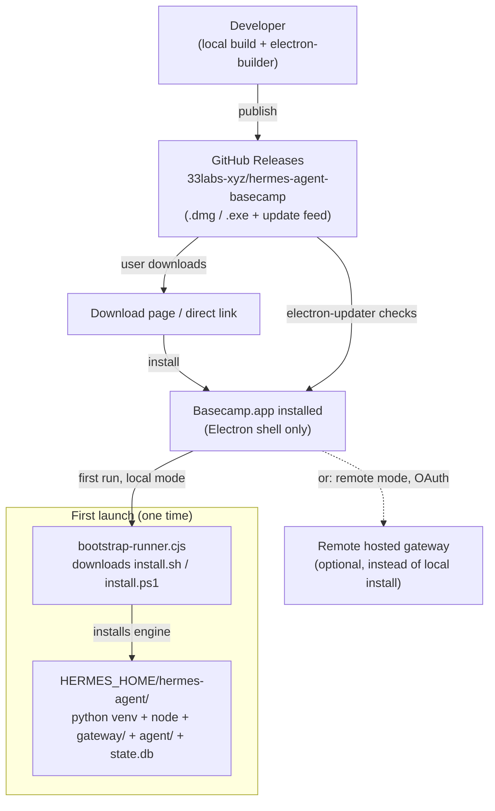
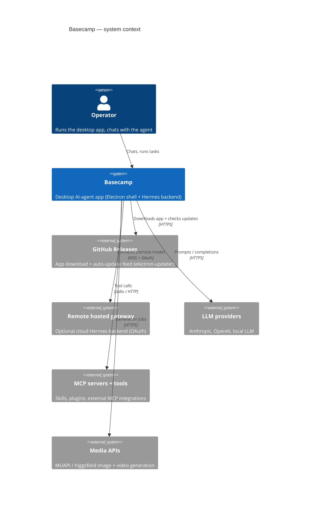
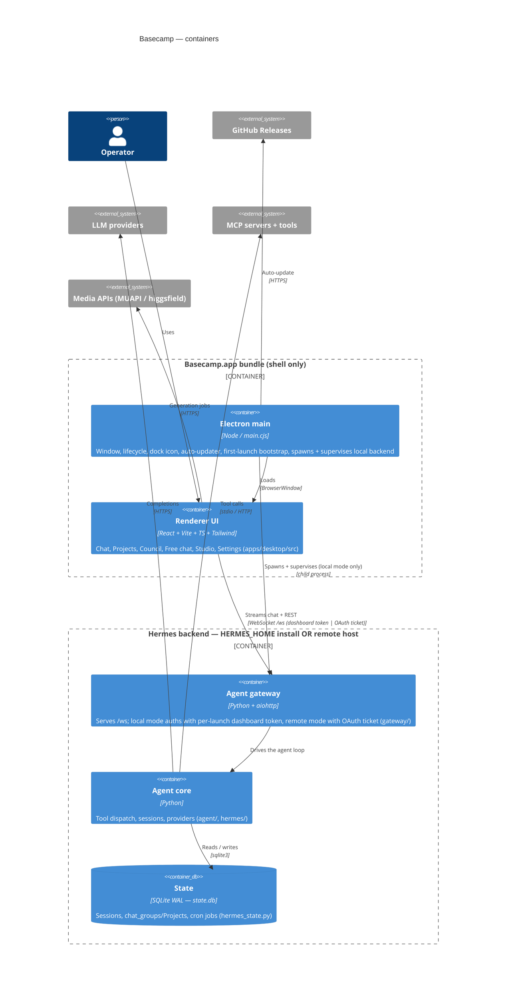

# Basecamp — Architecture

Basecamp is a desktop AI-agent app: a reskinned, upstream-mergeable build of the
Hermes Agent. The Electron app is the **product shell** — it does not contain the
agent engine. On first launch it installs the Hermes backend on the machine (or
connects to a remote hosted one), then drives that backend over a WebSocket.

This doc is **diagram-first, model-backed** (C4) plus one deployment view. Keep it
updated **in the same PR** as any change to the boxes or arrows. A stale diagram is
worse than none. The "why" behind these structures lives in [`../../docs/adr/`](../../docs/adr/).

- **Repo:** `33labs-xyz/hermes-agent-basecamp`
- **Product (shell) code:** `apps/desktop/` (this folder)
- **Backend (engine) code:** `gateway/`, `agent/`, `hermes/`, `hermes_state.py` (repo root) — ships as the installed Hermes Agent, NOT inside the `.app`

---

## Level 0 — Deployment / distribution

Where Basecamp comes from and how it gets running. This answers "doesn't it start
at GitHub?" — yes, the **artifact** starts at GitHub; the **running app** starts
locally and then provisions or connects to its backend.

**Notes:**

- The `.app` bundle ships **only the Electron shell**: renderer UI (`dist/**`),
  main process (`electron/**`), assets, icon, prebuilt native deps. It does NOT
  contain `gateway/`, `agent/`, or `state.db` (see electron-builder `files` /
  `extraResources` in `package.json`).
- **Local mode:** first launch runs `bootstrap-runner.cjs`, which downloads and
  executes `install.sh` / `install.ps1` to install the Hermes engine into
  `HERMES_HOME` (its own python venv + node). The engine — and `state.db` — live
  there, on disk, beside the app but not inside it.
- **Remote mode:** instead of a local engine, the app can connect to a hosted
  gateway and authenticate over OAuth (see Level 2).
- GitHub Releases is both the **origin** of the app and its **auto-update feed**.

---

## Level 1 — System context

Who and what Basecamp talks to. Readable by anyone.

---

## Level 2 — Containers

The runnable pieces. The key boundary: the **`.app` bundle is just the shell**;
the **backend is a separate process**, either installed at `HERMES_HOME` or hosted
remotely. The dashed boundary marks what ships inside the `.app`.

**Notes that the boxes can't hold:**

- **Two backend modes, one renderer.** The UI talks `/ws` either way; only the
  connection target + auth differ:
  - **Local mode:** Electron spawns the gateway installed at `HERMES_HOME`, bound
    to loopback, authed with a per-launch **dashboard token**. Not internet-exposed.
  - **Remote mode:** the renderer connects to a hosted gateway over WSS and auths
    with an **OAuth ticket** minted at `POST /api/auth/ws-ticket`
    (`apps/desktop/electron/connection-config.cjs`). Settings → Gateway controls this.
- **The `.app` does not contain the engine.** `gateway/`, `agent/`, `hermes/`,
  `state.db` are installed at `HERMES_HOME` on first launch (local mode) or live on
  the remote host. The bundle ships shell + native deps + installer stamp only.
- **`state.db` is local SQLite (WAL).** Projects (chat_groups), sessions, and cron
  persist there — in `HERMES_HOME` (local) or on the host (remote), never a cloud DB
  owned by the app itself.
- **Renderer surfaces (tabs):** Chat, Projects, Council, Free chat, Studio,
  Scheduled, Settings — each a folder under `apps/desktop/src/app/`.

---

## Level 3 — Components

Skip by default. Draw a component diagram **only** for a subsystem hairy enough to
need it — e.g. the first-launch bootstrap/install flow, the local-vs-remote
connection + auth path, or the Projects/chat_groups context-injection path. Add it
as `ARCHITECTURE-<subsystem>.md` next to this file and link it here.

- _(none yet)_

---

## Level 4 — Code

Don't. If you ever need class-level detail, generate it from source on demand
rather than hand-maintaining it.

---

## Maintenance rules

1. Touch the architecture → touch this file **in the same PR**.
2. Record non-obvious decisions as an ADR in [`../../docs/adr/`](../../docs/adr/)
   and link it from the code it governs.
3. Match detail to audience: Deployment + Context for anyone, Container for
   engineers, Component only where there is real confusion.
4. The bundle/backend boundary is the thing reviewers get wrong — keep the dashed
   `.app` boundary honest. If something new ships inside the `.app`, it goes inside
   the shell box; if it installs to `HERMES_HOME` or runs remote, it goes in the
   backend box.
